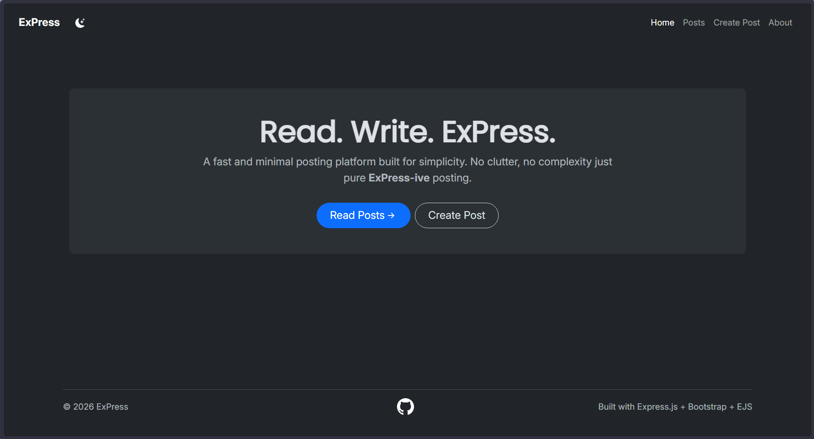
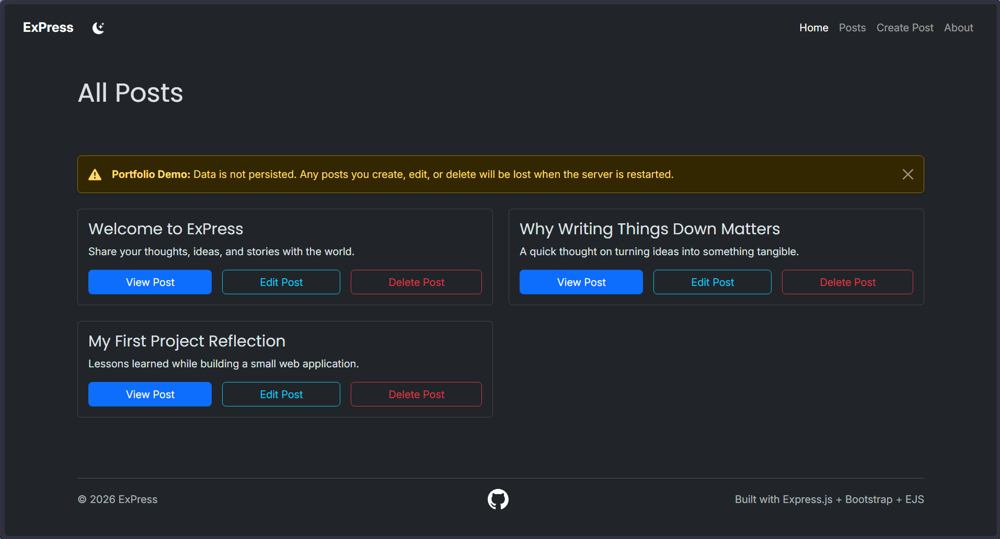
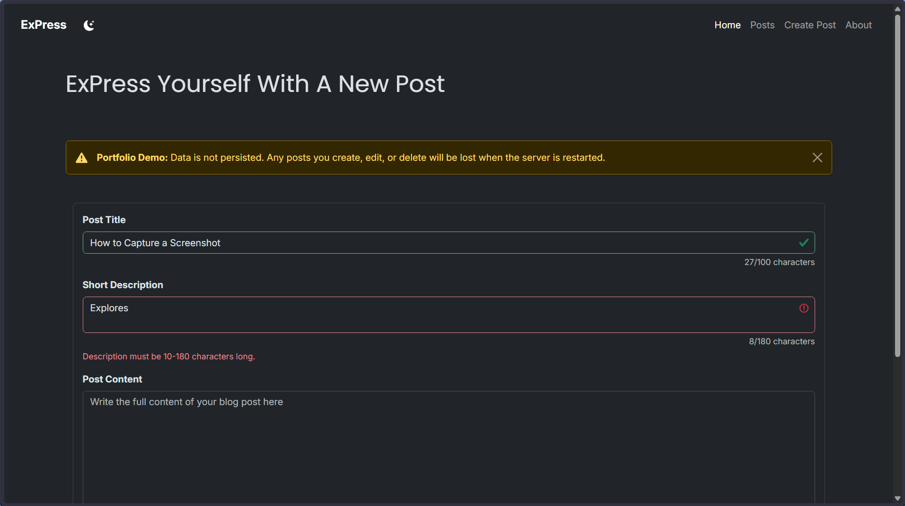
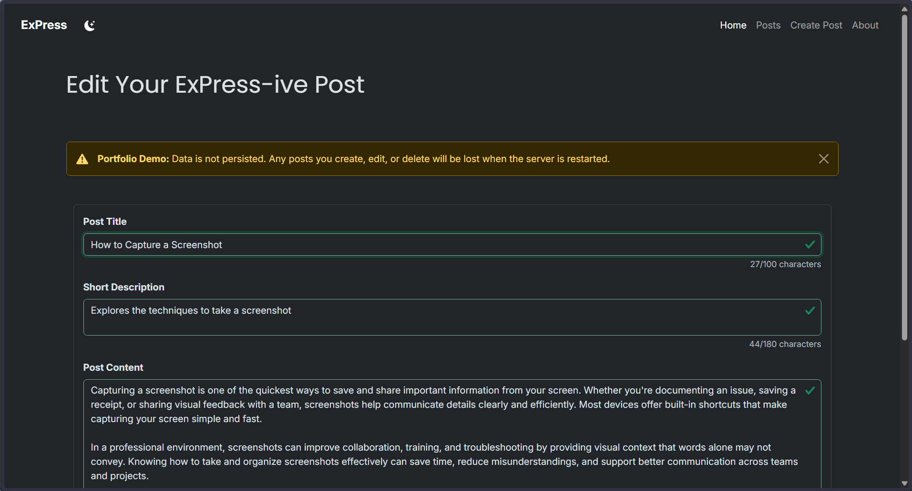
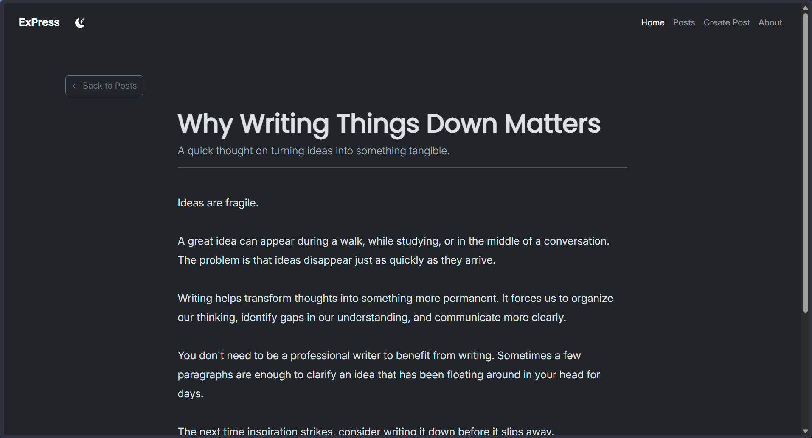
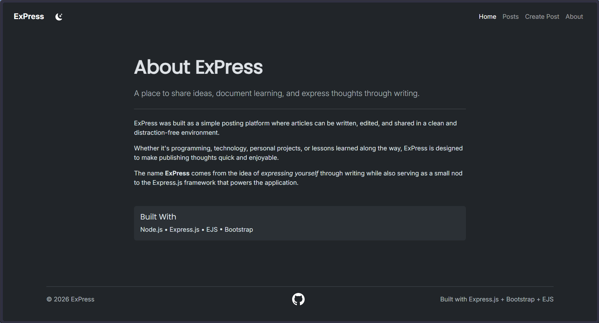
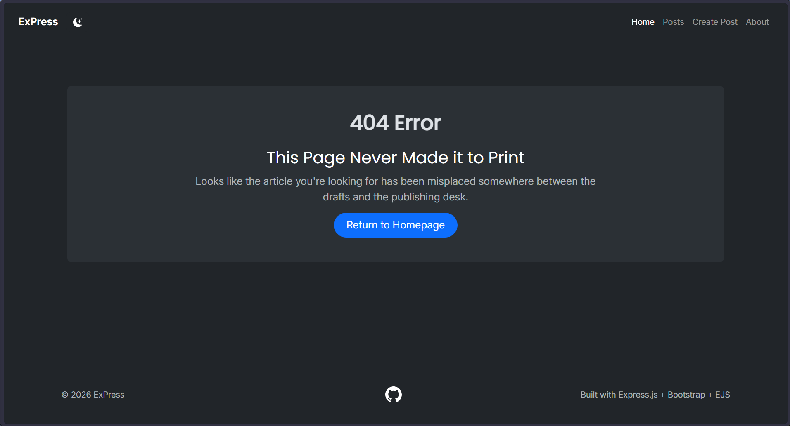

# ExPress

[](https://express-h37l.onrender.com)


A modern posting platform built with Express.js and EJS that allows users to create, view, edit, and delete posts through a clean, responsive interface.

ExPress was developed as a full-stack learning project focused on understanding server-side rendering, routing, CRUD operations, middleware, form handling, and responsive UI development with Bootstrap.

---

## Features

### Core Functionality

- Create new posts
- View all posts
- View individual posts
- Edit existing posts
- Delete posts with confirmation modal
- Custom 404 page for invalid routes

### User Experience

- Responsive Bootstrap-based interface
- Light and dark mode toggle
- Live form validation
- Character counters for all form fields
- Keyboard navigation improvements
- Dynamic success notifications
- Mobile-friendly layouts

### Form Validation

Posts are validated both through HTML constraints and client-side JavaScript feedback.

| Field       | Requirements          |
| ----------- | --------------------- |
| Title       | 3–100 characters      |
| Description | 10–180 characters     |
| Content     | Minimum 30 characters |

Additional features include:

- Real-time character counting
- Instant validation feedback
- Automatic focus progression using keyboard shortcuts
- Prevention of invalid form submissions

---

## Tech Stack

### Backend

- Node.js
- Express.js
- Morgan

### Frontend

- EJS
- Bootstrap 5
- Custom CSS
- Vanilla JavaScript

### Development Tools

- Nodemon

---

## Project Structure

```text
ExPress/
├── assets/
│   └── screenshots/
│       ├── home.png
│       ├── posts.png
│       ├── create-post.png
│       ├── edit-post.png
│       ├── single-post.png
│       ├── about.png
│       └── 404.png
├── public/
│   ├── index.js
│   └── styles.css
│
├── views/
│   ├── partials/
│   │   ├── delete-modal.ejs
│   │   ├── footer.ejs
│   │   ├── header.ejs
│   │   ├── post-form.ejs
│   │   └── warning.ejs
│   │
│   ├── 404.ejs
│   ├── about.ejs
│   ├── edit.ejs
│   ├── index.ejs
│   ├── new.ejs
│   ├── post.ejs
│   └── posts.ejs
│
├── app.js
├── package.json
├── package-lock.json
├── README.md
└── .gitignore
```

---

## Installation

### Clone the Repository

```bash
git clone https://github.com/OzenFern/ExPress
cd ExPress
```

### Install Dependencies

```bash
npm install
```

### Start Development Server

```bash
npm run dev
```

### Start Production Server

```bash
npm start
```

The application will be available at:

```text
http://localhost:3000
```

---

## Screenshots

### Home Page



### Posts Page



### Create Post Page



### Edit Post Page



### Single Post View



### About Page



### Custom 404 Page



---

## Known Limitations

This project currently stores posts in memory.

As a result:

- Posts are lost when the server restarts
- No database persistence
- No user authentication
- No account system

A warning banner is displayed throughout the application to communicate this behavior.

---

## Future Improvements

- Database integration (PostgreSQL or MongoDB)
- User authentication and authorization
- Rich text editor
- Search and filtering
- Categories and tags
- Image uploads
- Pagination
- Markdown support
- User profiles
- REST API endpoints

---

## Learning Outcomes

This project was built to gain hands-on experience with:

- Express.js routing
- Middleware
- CRUD operations
- EJS templating
- Server-side rendering
- Form handling and validation
- Responsive design
- Reusable UI components
- Application structure and organization

---

## Author

**Ozen Fernandes**

Built as part of my journey in learning backend and full-stack web development.
